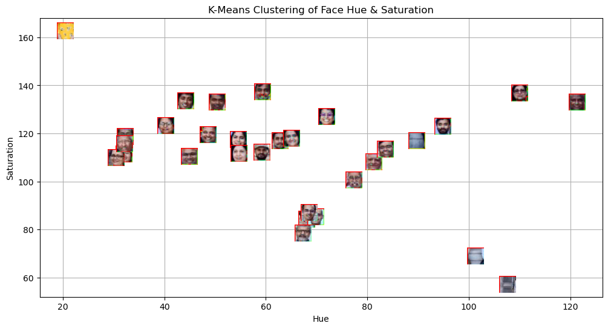
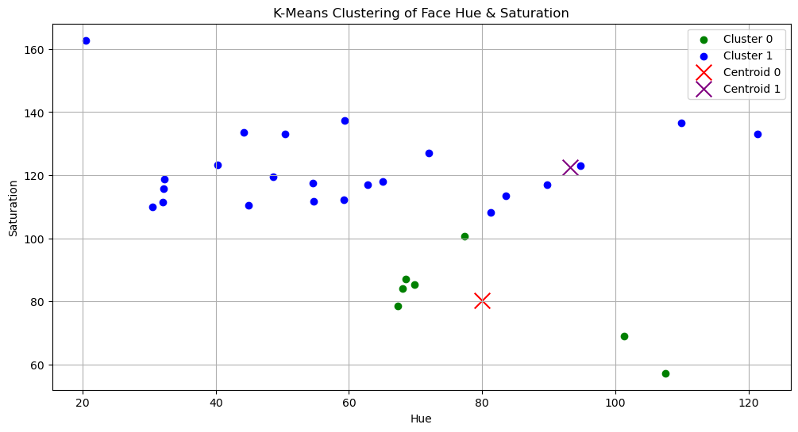
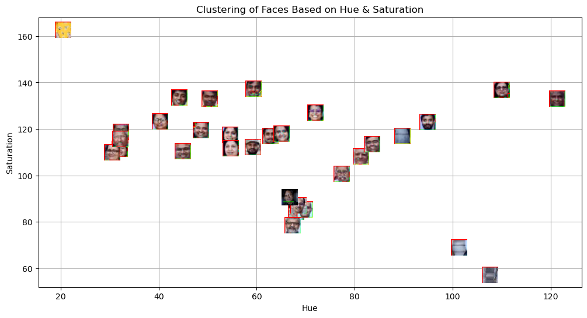
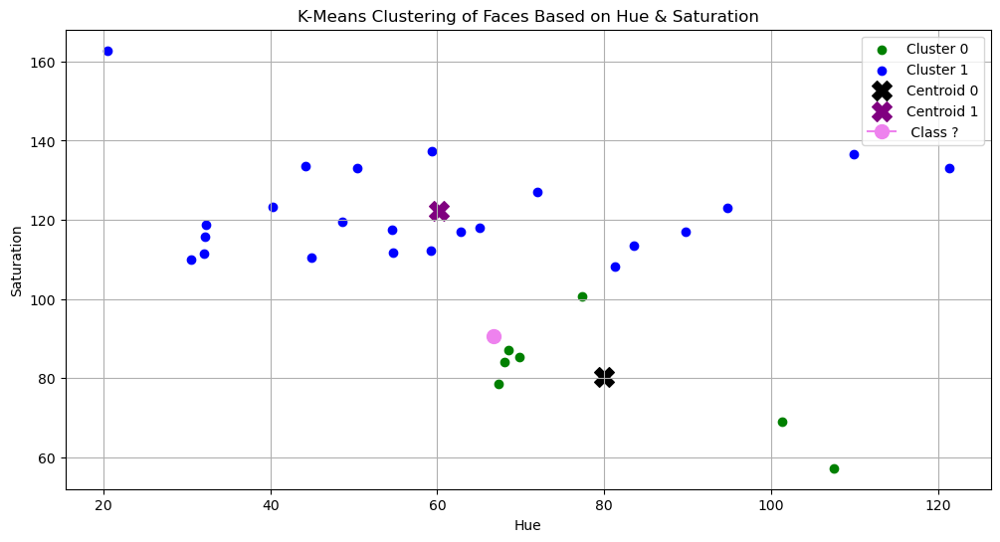

#### 1. What are the common distance metrics used in distance-based classification algorithms?  
Euclidean Distance: Measures straight-line distance between two points.
Manhattan Distance: Measures distance along axes at right angles
Cosine Similarity: Measures the angle between two vectors
Chebyshev Distance: As the king in game of chess moves diagonally, horizontally, or vertically in one move.
#### 2. What are some real-world applications of distance-based classification algorithms? 
Recommender Systems:to find similar users based on preferences.
Medical Diagnosis: identifies diseasses based on patient symptoms using past cases.
Anomaly Detection: Used in fraud detrection to identify unusual behavior.
#### 3. Explain various distance metrics. 
same as question 1
Euclidean Distance: Measures straight-line distance between two points.
Manhattan Distance: Measures distance along axes at right angles
Cosine Similarity: Measures the angle between two vectors
Chebyshev Distance: As the king in game of chess moves diagonally, horizontally, or vertically in one move.
#### 4. What is the role of cross validation in model performance? 
Cross validation helps assess how well a model generalizes to test data or data that is new for the model.It also reduces overfitting by training and testing the model on different data subsets.
#### 5. Explain variance and bias in terms of KNN? 
Low K means high variance, low bias which casues overfitting whereas, high K means Low variance, high bias casuing underfitting of data.Hence it is essential to choose an optial K such that it balances bias and variance.

### Image 1  
  

### Image 2  
  

### Image 3  
  

### Image 4  

